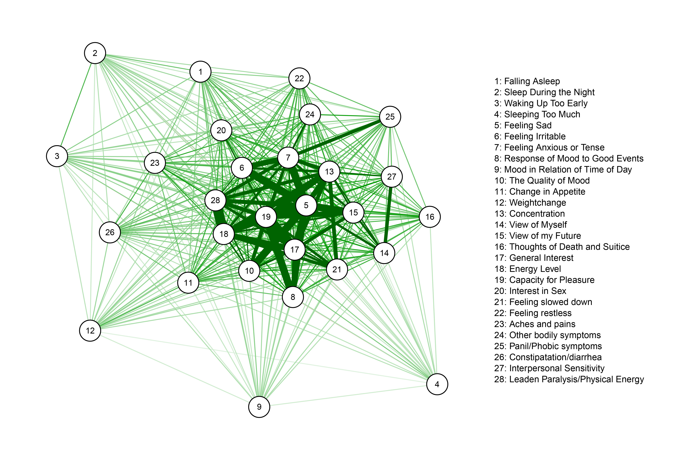

## Overview

0. Installing Software & Packages
1. Why Networks?
2. What are Networks?
3. Constructing a Network
4. Correlation Networks
5. Conditional Independence Networks

## Installing Software & Packages

- Install R: http://cran.freestatistics.org
- Install RStudio: https://www.rstudio.com/products/rstudio/download/
- Install packages:

```{r, eval=FALSE}
install.packages('qgraph') # Network visualization
install.packages('mgm') # Mixed Graphical Models & mixed VAR
install.packages('httr') # Download data files from https
```

- Load packages:

```{r, eval=TRUE, message=FALSE}
library(qgraph)
library(mgm)
library(httr)
```


## Download R - file with code of all exercises

Download the R-file with all exercises here:

<http://jmbh.github.io>

(Here you can also find the slides)

## What are Networks?

```{r, out.width = 450, fig.retina = NULL, echo=FALSE, fig.align='center'}

knitr::include_graphics("Example_Graph.jpg")

```

<center>  Nodes = Entities; Edges = Relations </center> 


## Computer Network

```{r, out.width = 550, fig.retina = NULL, echo=FALSE, fig.align='center'}

knitr::include_graphics("computernetwork.jpg")

```


## Network of Corporate Control

```{r, out.width = 750, fig.retina = NULL, echo=FALSE, fig.align='center'}

knitr::include_graphics("corpcontrol.png")

```


<center>  Vitali et al. 2011 </center> 

## Facebook Friendship network

```{r, out.width = 400, fig.retina = NULL, echo=FALSE, fig.align='center'}
knitr::include_graphics("facebook-friend-graph.png")
```


## Psychopathological Classification Network

```{r, out.width = 650, fig.retina = NULL, echo=FALSE, fig.align='center'}
knitr::include_graphics("DSM_graph.JPG")
```

<center>  (Borsboom et al., 2011) </center> 

## Psychopathological Symptom Network

```{r, out.width = 650, fig.retina = NULL, echo=FALSE, fig.align='center'}

```


## Different types of Networks

```{r, out.width = 450, fig.retina = NULL, echo=FALSE, fig.align='center'}
knitr::include_graphics("Examples_DifferentGraphs.jpg")
```


## Let's construct a Network!

```{r}

AdjacencyMatrix <- matrix(0,4,4)
AdjacencyMatrix[1,2] <- AdjacencyMatrix[2,1] <- 1
AdjacencyMatrix[2,3] <- AdjacencyMatrix[3,2] <- 1
AdjacencyMatrix[2,4] <- AdjacencyMatrix[4,2] <- 1

AdjacencyMatrix

```

## Our first network visualization

```{r}

qgraph(AdjacencyMatrix)

```


## Generate a random network

```{r}
p <- 20
AdjMatrix <- matrix(0,p,p)
set.seed(22)
AdjMatrix[upper.tri(AdjMatrix)] <- sample(0:1,(p*(p-1))/2, 
                                         prob=c(.9,.1),replace=TRUE)
AdjMatrix <- AdjMatrix + t(AdjMatrix)

AdjMatrix[1:5,1:5]

```


## Visualize the Random Network

```{r}

qgraph(AdjMatrix)

```


## Correlation Networks

```{r, out.width = 700, fig.retina = NULL, echo=FALSE, fig.align='center'}

knitr::include_graphics("Pic_CorrelationNetwork.png")

```


## Correlation Networks - Load data

Load Depression data from web:

```{r, message=FALSE}

url='https://jmbh.github.io/figs/efpsa_workshop/BDIdata.RDS'
GET(url, write_disk("BDIdata.RDS", overwrite=TRUE))
BDI_data <- readRDS('BDIdata.RDS')

```

3640 Responses to Beck's Depression Inventory (BDI)


## Correlation Networks - look at data

Let's have a first look at the data:

```{r}

# data
BDI_data$data[1:3,1:5]

#labels
BDI_data$vnames[1:5]

```


## Compute Correlation Matrix

```{r}
CorMatrix <- cor(BDI_data$data)

round(CorMatrix[1:4, 1:4],2)

```


## Visualize Correlation Matrix

```{r}

qgraph(CorMatrix, nodeNames=BDI_data$vnames, legend.cex = .3, vsize=4)

```


## Visualize Correlation Matrix

```{r}

qgraph(CorMatrix, nodeNames=BDI_data$vnames, 
       legend.cex = .3, layout='spring', vsize=3)

```


## The Problem with spurious correlations

```{r, out.width = 700, fig.retina = NULL, echo=FALSE, fig.align='center'}

knitr::include_graphics("Spurious_Cor_illustration.jpg")

```


## Conditional Independence Networks

```{r, out.width = 700, fig.retina = NULL, echo=FALSE, fig.align='center'}

knitr::include_graphics("ConditionalDependenceNetworks.png")

```


## Conditional Independence Networks - Estimation

```{r}

fit <- mgmfit(BDI_data$data, rep('g', 28), rep(1, 28), pbar=FALSE)

round(fit$wadj[1:4, 1:4],2)

```


## Conditional Independence Networks - Visualization

```{r}

qgraph(fit$wadj, nodeNames=BDI_data$vnames, 
       legend.cex = .3, layout='spring', vsize=3)

```


## Conditional Independence Networks from Mixed Data

```{r, out.width = 700, fig.retina = NULL, echo=FALSE, fig.align='center'}

knitr::include_graphics("whymixedMRFs.jpg")

```

## Mixed Data: Autism Dataset

Load data from the web:

```{r, message=FALSE}

url='http://jmbh.github.io/figs/efpsa_workshop/autism_datalist.RDS'
GET(url, write_disk("autism_datalist.RDS", overwrite=TRUE))
Autism_data <- readRDS('autism_datalist.RDS')

dim(Autism_data$data)

```


## Mixed Autism Dataset - Look at data

```{r}

Autism_data$data[1:3, 1:5]

Autism_data$type # type of each variable

Autism_data$lev # no of categories of each variable

```


## Mixed Autism Dataset - Estimation

```{r, message=FALSE}

#fit2 <- mgmfit(Autism_data$data, Autism_data$type, Autism_data$lev, 
#                d=2, pbar=FALSE) # commented out as it takes a while

# instead we download the fit object here:
url='http://jmbh.github.io/figs/efpsa_workshop/fitobj_mixed.RDS'
GET(url, write_disk("fitobj_mixed.RDS", overwrite=TRUE))
fit2 <- readRDS('fitobj_mixed.RDS')


```


## Mixed Autism Dataset - Visualization

```{r}

qgraph(fit2$wadj, nodeNames=Autism_data$colnames, 
       layout='spring', edge.color=fit2$edgecolor, 
       legend.cex=.3, vsize=3)


```


## Mixed Autism Dataset - Visualization II

```{r, eval=FALSE, message=FALSE}

# define groups of variables
groups_type <- list("Demographics"=c(1,14,15,28), 
                    "Psychological"=c(2,4,5,6,18,20,21),
                    "Social environment" = c(7,16,17,19,26,27),
                    "Medical"=c(3,8,9,10,11,12,13,22,23,24,25))

# define nice colors for groups
group_col <- c("#72CF53", "#53B0CF", "#FFB026", "#ED3939")


qgraph(fit2$wadj, nodeNames=Autism_data$colnames, 
       layout='spring', edge.color=fit2$edgecolor, 
       legend.cex=.3, vsize=3, color=group_col, 
       groups=groups_type)

```


## Mixed Autism Dataset - Visualization II

```{r, out.width = 700, fig.retina = NULL, echo=FALSE, fig.align='center'}

knitr::include_graphics("JSS_autism_figure_weighted.jpg")

```


## What have we learned?

- Set up a (random) Nework in R
- Compute and Visualize Correlation Network
- Estimate and Visualize Conditional Independence Networks

But there is much more ...

- Closer Examination of Categorical Variables
- Directed Networks
- Networks that change over time
- ...

Contact:

jonashaslbeck@gmail.com / http://jmbh.github.io (slides+code)


## Suggested Reading 

- Introductory paper on Network Analysis in Psychology using R

Costantini et al. (2015). State of the aRt personality research: A tutorial on network analysis of personality data in R. Journal of Research in Personality, 54, 13-29.

- Paper introducing (directed) VAR models in psychopathology:

Bringmann et al. (2013). A network approach to psychopathology: new insights into clinical longitudinal data. PloS one, 8(4), e60188.

- Paper describing all functionalities of the mgm package:

Haslbeck & Waldorp (under review). mgm: Structure Estimation for Time-Varying Mixed Graphical Models in high-dimensional Data. http://arxiv.org/pdf/1510.06871v2.pdf


